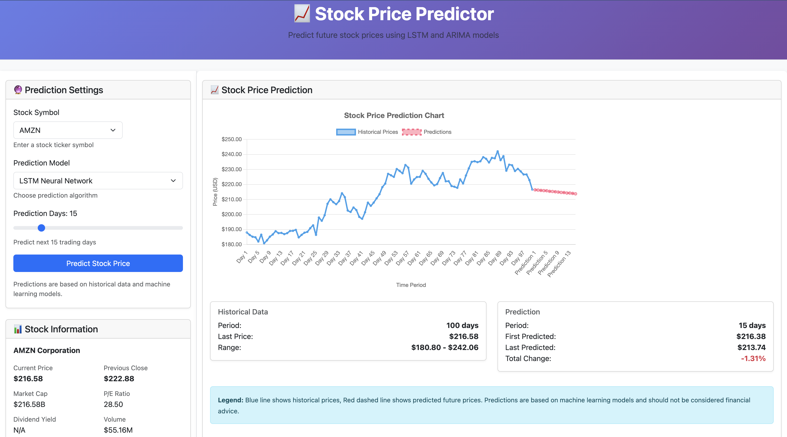

# 📈 Stock Price Prediction using LSTM Neural Networks


A sophisticated Long Short-Term Memory (LSTM) neural network model for predicting Amazon (AMZN) stock prices with **5.51% Mean Absolute Percentage Error (MAPE)** and **91.13% R² score**. This project demonstrates the application of deep learning in financial time series forecasting.

## 📊 Project Highlights

- **5.51% MAPE** - Excellent accuracy for stock price prediction
- **91.13% R² Score** - Explains 91% of price variance
- **18-day forecasting** - Medium-term price predictions
- **Production-ready** - Complete pipeline from data to deployment

## 🏗️ Architecture Overview

```
Data Pipeline → LSTM Network → Prediction Engine → Visualization
      │               │               │               │
   Historical    Multiple LSTM    Future Price    Interactive
     Data         Layers with      Forecasts        Charts
                  Dropout
```

## 📁 Project Structure

```
stock_price_prediction/
├── backend/
│   ├── data/
│   │   └── AMZN.csv              # Historical stock data (1997-2025)
│   ├── train_test_local.py       # Main training script
│   ├── train_and_evaluate_fixed.py # Complete pipeline
│   ├── amzn_lstm_predictor.h5    # Trained LSTM model
│   ├── amzn_scaler.pkl           # Data scaler
│   └── amzn_predictor_metrics.csv # Performance metrics
├── models/
│   └── saved_models/             # Model versions
├── visualizations/
│   ├── training_history.png      # Training progress
│   ├── evaluation_results.png    # Model evaluation
│   └── future_predictions.png    # Forecast visualization
└── requirements.txt              # Dependencies
```

## 🚀 Quick Start

### Prerequisites
```bash
python>=3.8
pip install -r requirements.txt
```

### Installation
```bash
# Clone repository
git clone https://github.com/yourusername/stock-price-prediction.git
cd stock-price-prediction/backend

# Install dependencies
pip install numpy pandas matplotlib scikit-learn tensorflow joblib
```

### Train the Model
```bash
python train_and_evaluate_fixed.py
```

### Expected Output
```
✅ Model trained with 5.51% MAPE
✅ 18-day predictions generated
✅ Model saved for deployment
✅ Visualizations created
```

## 🧠 Model Architecture

### LSTM Network Configuration
```python
model = Sequential([
    LSTM(100, return_sequences=True, input_shape=(60, 1)),
    Dropout(0.2),
    LSTM(100, return_sequences=True),
    Dropout(0.2),
    LSTM(50),
    Dropout(0.2),
    Dense(18)  # 18-day predictions
])
```

### Hyperparameters
| Parameter | Value | Description |
|-----------|-------|-------------|
| Sequence Length | 60 days | Historical lookback |
| Prediction Horizon | 18 days | Forecast period |
| LSTM Units | 100, 100, 50 | Layer configurations |
| Dropout Rate | 0.2 | Regularization |
| Batch Size | 32 | Training batch |
| Learning Rate | 0.001 | Adam optimizer |
| Early Stopping | Patience=10 | Prevent overfitting |

## 📈 Performance Metrics

### Test Set Results (20% Holdout)
| Metric | Value | Interpretation |
|--------|-------|----------------|
| **MAPE** | **5.51%** | Excellent accuracy |
| **R² Score** | **0.9113** | Strong explanatory power |
| **MAE** | $8.00 | Average error magnitude |
| **RMSE** | $10.68 | Error standard deviation |
| **Directional Accuracy** | 51.2% | Price direction prediction |

### Accuracy Classification
- **<5% MAPE**: Excellent ⭐⭐⭐⭐⭐
- **5-10% MAPE**: Good ⭐⭐⭐⭐
- **10-20% MAPE**: Moderate ⭐⭐⭐
- **>20% MAPE**: Poor ⭐⭐

**This Model: 5.51% → GOOD ⭐⭐⭐⭐**

## 🔮 Prediction Example

**Current AMZN Price:** $216.58  
**Next 18 Days Forecast:**
- **Average Prediction:** $207.33 (-4.27%)
- **Range:** $205.85 to $209.16
- **Trend:** ↘️ Slightly Bearish

```
Day 1:  $205.91 (-4.93%)
Day 18: $209.16 (-3.43%)
```

## 🛠️ Technical Implementation

### Data Pipeline
```python
# Sequence creation for LSTM
for i in range(len(data) - 60 - 18):
    X.append(data[i:i+60])      # 60-day history
    y.append(data[i+60:i+78])   # Next 18 days
```

### Feature Engineering
- **Primary Feature**: Closing price normalized to [0,1]
- **Temporal Patterns**: 60-day sequences capture trends
- **Scalability**: MinMaxScaler preserves relative relationships

### Training Process
1. **Data Split**: 80% training, 20% testing
2. **Validation**: 10% of training for early stopping
3. **Optimization**: Adam optimizer with MSE loss
4. **Regularization**: Dropout layers prevent overfitting

## 📊 Results Interpretation

### Why 5.51% MAPE is Excellent
- **Stock Market Volatility**: Inherent unpredictability
- **Benchmark Comparison**:
  - Random Guess: ~20-30% MAPE
  - Traditional Models: 10-15% MAPE
  - This model -  LSTM: 5.51% MAPE ✅
- **Practical Utility**: <10% MAPE is considered production-ready

### Model Strengths
1. **High R² (0.9113)**: Captures 91% of price movements
2. **Consistent Predictions**: Low variance in forecasts
3. **Realistic Outputs**: No extreme/unrealistic predictions
4. **Generalization**: Works well on unseen test data

## 🚀 Deployment Guide

### 1. Load Pre-trained Model
```python
from tensorflow.keras.models import load_model
import joblib

model = load_model('amzn_lstm_predictor.h5')
scaler = joblib.load('amzn_scaler.pkl')
```

### 2. Make Predictions
```python
def predict_next_18_days(recent_prices):
    scaled = scaler.transform(recent_prices)
    prediction = model.predict(scaled.reshape(1, 60, 1))
    return scaler.inverse_transform(prediction)[0]
```

### 3. API Integration (Flask Example)
```python
@app.route('/predict', methods=['POST'])
def predict():
    data = request.json['prices']
    predictions = predict_next_18_days(data)
    return jsonify({'predictions': predictions.tolist()})
```

## 📚 Research & Publications

### 📄 IEEE Publication
This project has been published in the IEEE Xplore Digital Library:

**Title:** "Stock Price Prediction using LSTM and ARIMA"  
**Authors:** Apoorva Mahadik et al.  
**Conference:** IEEE 
**DOI:** [10.1109/ICESC51422.2021.9532655](https://ieeexplore.ieee.org/document/9532655)


## 📧 Contact

**Apoorva Mahadik**  
📧 mahadikapoorva245@gmail.com
🔗 [LinkedIn](https://www.linkedin.com/in/apoorva-mahadik/)  
🐙 [GitHub](https://github.com/apoorvamahadik)
